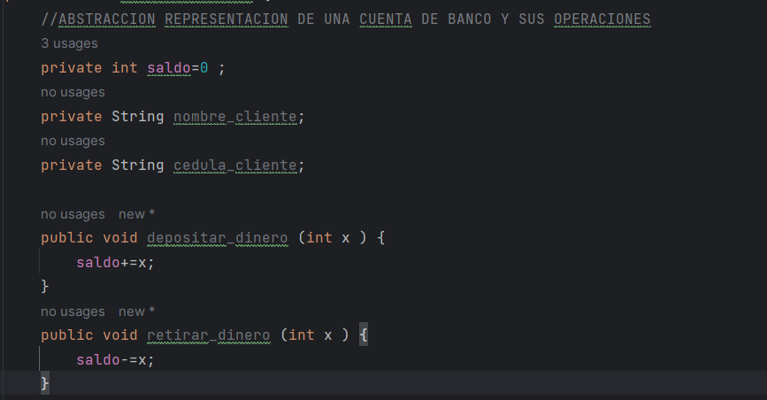
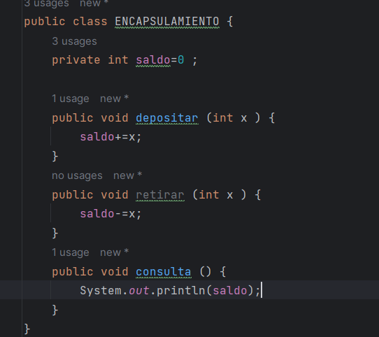
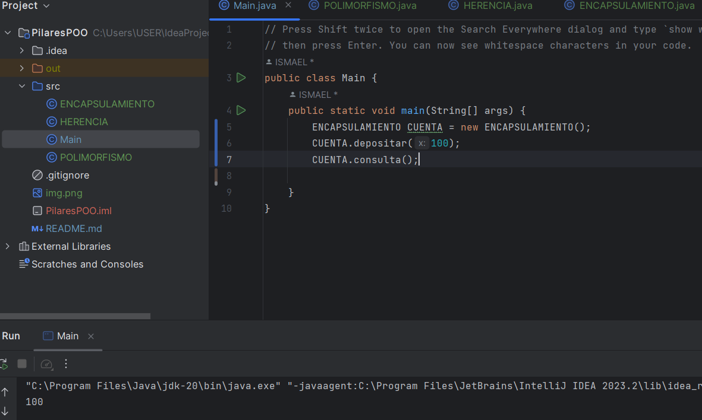
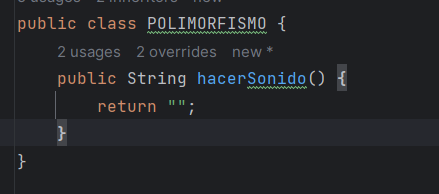
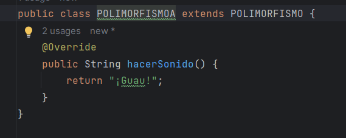
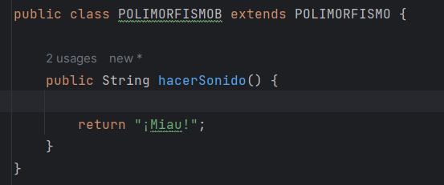
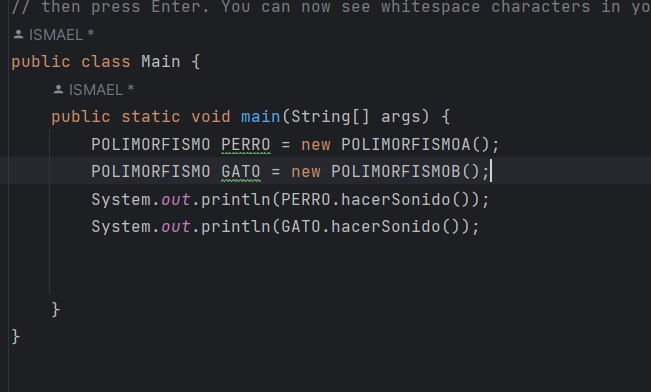
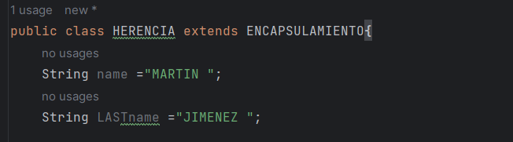
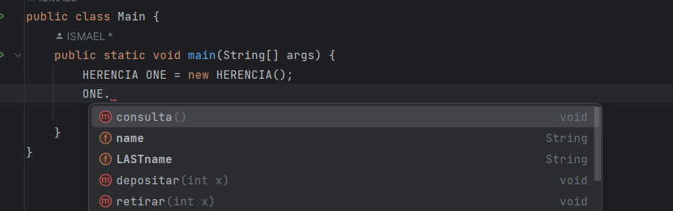

PILARES DE LA PROGRAMACION ORIENTADA A OBJETOS
##
1. ABSTRACCION
   
Es el proceso de simplificar la complejidad real de un objeto, resaltando las características más importantes y ocultando los detalles innecesarios para comprender su funcionalidad. Es una manera de modelar o representar objetos reales destacando sus aspectos más relevantes según el contexto del programa.

EJEMPLO 

Aqui observamos como se lleva el manejo de una cuenta de banco a un nivel de programacion con un lenguaje adecuado y acciones semejantes de la vida real. 

2. ENCAPSULAMIENTO 

Es el principio que busca restringir el acceso a ciertos componentes o detalles internos de un objeto y exponer solo lo que es seguro o necesario para su interacción. Con el encapsulamiento, se protegen y ocultan los datos internos de un objeto, permitiendo acceder o modificar esos datos solo a través de métodos definidos.

EJEMPLO

En este caso vemos como el atributo saldo no es visible fuera de su clase y se puede acceder unicamente a el mediante los metodos publicos en el main. 

MAIN

3. POLIMORFISMO
   
Se refiere a la capacidad de un objeto de tomar muchas formas. Más específicamente, permite que diferentes clases tengan métodos con el mismo nombre, pero con comportamientos diferentes. Esto significa que diferentes objetos pueden ser tratados como instancias de la misma clase y, aún así, responder de manera única al mismo método.
EJEMPLO
Aqui observamos 3 clases y el mismo metodo heredado pero de actuar diferente segun la clase con una sobreescritura 

Clase 1 

Clase 2

Clase 3

Por ultimo podemos ver como actua de forma diferente el metodo hacersonido respectivamente a su clase 

4. HERENCIA
   
Es un mecanismo que permite a una clase (llamada subclase o clase hija) heredar atributos y métodos de otra clase (llamada superclase o clase padre). Gracias a la herencia, se pueden crear nuevas clases basándose en clases ya existentes, promoviendo la reutilización de código y estableciendo una relación jerárquica entre clases.
EJEMPLO 
En este caso vemos como la clase ENCAPSULAMIENTO hereda a la clase HERENCIA mediante el uso de EXTENDS

Gracias a esto el objeto puede acceder a los atributos y metodos propios de su clase y de la clase ENCAPSULAMIENTO 

